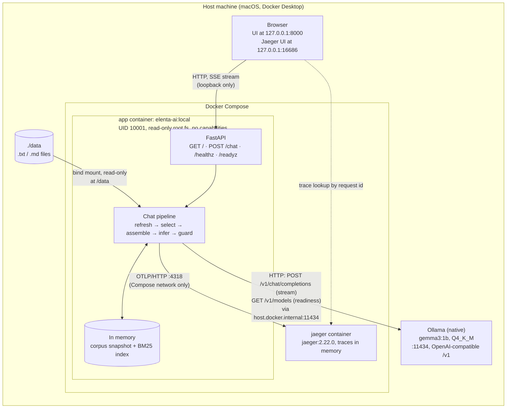

# Architecture

How the system is put together: the components, the boundaries inside the app, where state lives and how the app reaches the model (REQ-102). The decisions behind each part are in [architecture-decisions.md](architecture-decisions.md); the step-by-step request path is in the request and data flow document (to be written, REQ-103).

## System diagram

Published ports are bound to `127.0.0.1` only: `8000` (app) and `16686` (Jaeger UI). Jaeger's OTLP port `4318` is reachable only from inside the Compose network. JSON logs go to the app container's stderr (`docker compose logs app`).

## Components

| Component | What it is | Started by | Decision |
|---|---|---|---|
| **App** | Python 3.12, FastAPI + Uvicorn, in image `elenta-ai:local` (two-stage build from `uv.lock`; runtime stage has no `pip`) | `docker compose up` | ADR-001, ADR-012, ADR-014 |
| **Browser UI** | Three static files (`app/static/`), served by the app; plain text rendering only | Served at `/` | ADR-010 |
| **Model server** | Ollama on the host, model `gemma3:1b` (999.89M parameters, Q4_K_M), context pinned to 4096 tokens | The user (a prerequisite) | ADR-013, ADR-016, TS-005 |
| **Trace viewer** | Jaeger 2.22.0 (single binary with UI and collector), pinned by digest, in-memory storage | `docker compose up` | ADR-008, TS-010 |
| **Corpus** | Host `./data`, mounted read-only at `/data` | Bind mount | ADR-005, ADR-012 |

**Why the model runs outside Compose.** Docker Model Runner, the brief's preferred backend, is not available on the development machine (TS-001). Ollama runs natively on the host rather than as a Compose service, reusing the model already pulled there (ADR-013, option B). The cost is that `docker compose up` does not start the model server; `/readyz` reports when it is missing. The app does not depend on which server it is: it uses only the standard OpenAI-compatible API, configured by `LLM_URL` and `LLM_MODEL` (REQ-015, REQ-022). The trace records which backend served each request (`llm.backend`).

## Boundaries inside the app

Each boundary from brief §5.9 is one module, and each module opens with a comment block stating its purpose (REQ-090, REQ-091).

| Boundary | Module | Responsibility | Holds state? |
|---|---|---|---|
| Configuration | `app/config.py` | The only module that reads environment variables. Validates everything once at startup; exits with code 2 listing every problem | No |
| Ingestion | `app/ingestion.py` | Finds files under the corpus root and reads them safely (no symlinks, hidden files, pipes, oversized or half-written files) | No |
| Corpus state | `app/corpus.py` | Builds one immutable snapshot per refresh; reuses unchanged files by fingerprint | Yes: last snapshot and per-file cache |
| Indexing | `app/chunking.py`, `app/index.py` | Splits documents into chunks with stable ids; BM25 index rebuilt when the snapshot changes | Yes: index and chunk cache |
| Context selection | `app/selection.py`, `app/tokens.py` | Chooses evidence for a question within the token budget; decides "not enough evidence" without the model | No |
| Prompt assembly | `app/prompt.py` | Builds the messages: fixed instructions, then delimited evidence, then the question; checks the context window | No |
| Inference access | `app/inference.py`, `app/health.py` | Streams from the OpenAI-compatible endpoint with three timeouts; turns every failure into a fixed error code. Readiness probe | No |
| Output safety | `app/output_guard.py` | Removes reasoning blocks and blocks instruction leaks in the streamed answer | No (per request) |
| Orchestration | `app/chat.py` | Runs the stages for one request and emits events; owns the trace | No |
| Transport | `app/sse.py`, `app/main.py` | SSE framing; routes, security headers, lifetime of shared objects | No |
| Observability | `app/observability.py` | JSON logs with the request id; OpenTelemetry tracer and exporter | No |

Dependencies run one way. `main` builds the app and calls `chat`; `chat` calls the stage modules in order. Stage modules import only the data types of the stage before them (`ingestion` → `corpus` → `index` → `selection` → `prompt`), receive their settings as arguments, and know nothing about HTTP. Only `config` reads the environment.

## Storage

There is **no database and nothing is written to disk** by the app (its root filesystem is read-only; only `/tmp` is a writable tmpfs).

| Data | Where | Lifetime |
|---|---|---|
| Documents | Host `./data`, read-only in the container | Owned by the user |
| Corpus snapshot (text of every served file) | App memory | Replaced on each refresh; lost on restart and rebuilt on the first question |
| BM25 index and chunk cache | App memory | Rebuilt when the snapshot changes; entries for deleted files are dropped |
| Traces | Jaeger memory | Lost when the Jaeger container restarts |
| Logs | Container stderr, kept by Docker | Until the container is removed |

Because state is rebuilt from `./data` on demand, a restart needs no recovery step.

## Model connection

| Aspect | How it works |
|---|---|
| Protocol | OpenAI-compatible HTTP: `POST {LLM_URL}/chat/completions` with `stream: true`; `GET {LLM_URL}/models` for readiness |
| Address | `LLM_URL=http://host.docker.internal:11434/v1`. Docker Desktop provides `host.docker.internal`; Compose adds it for native Linux (`host-gateway`) |
| Request | Standard fields only: `model`, `messages`, `stream`, `max_tokens`, `temperature` (0), `stream_options.include_usage` |
| Client | One shared `httpx.AsyncClient`, created and closed with the app |
| Timeouts | Connect 5 s, gap between streamed pieces 60 s, whole call 180 s (configurable) |
| Cancellation | If the browser disconnects or presses Stop, the upstream response is closed and the model stops generating (REQ-033) |
| Failures | Each becomes a fixed code: `model_unavailable`, `model_timeout`, `model_http_error`, `model_stream_failed`, shown to the user with the request id |
| Switching backend | Change `LLM_URL` and `LLM_MODEL` in `.env`; no code change. Docker Model Runner would be `http://model-runner.docker.internal/engines/v1` |
