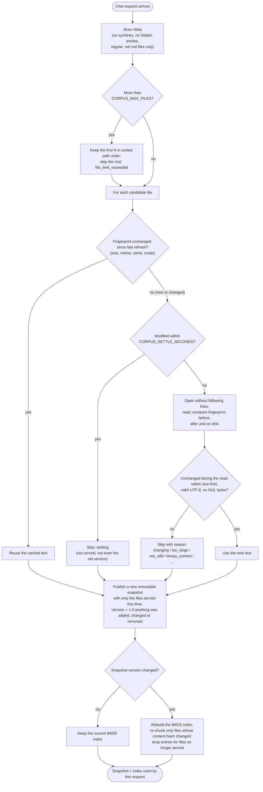

# Request and data flow

What happens, step by step, when the corpus changes and when a question is asked (REQ-103). Components are described in [Architecture](architecture.md); the reasons for each step are in the ADRs cited.

There is no background process: **the corpus is refreshed at the start of every chat request** (ADR-005). So the two flows below are one sequence: a question triggers a refresh, then the answer is built from the snapshot that refresh produced.

## 1. Corpus refresh

Code: `app/corpus.py` (`Corpus.refresh`), `app/ingestion.py` (`scan`, `read`), `app/index.py` (`IndexCache.get`). Runs in a worker thread, one refresh at a time (a lock), so file I/O never blocks the event loop.



**What each kind of change does on the next question:**

| Change in `./data` | Effect |
|---|---|
| File added | Read and served, once it has been unchanged for the settle window (0.5 s by default) |
| File edited | Re-read; the old text is gone from the snapshot and the index. Chunk ids change, because they include a hash of the text |
| File renamed | Seen as one file removed and one added; served under the new path |
| File deleted | Not in the new snapshot; its chunks are dropped from the index. Nothing stale survives (REQ-044) |
| File being written | Skipped as `settling` or `changing` and served on a later question once stable. Never a mix of old and new text (REQ-045) |
| Unreadable, corrupt or unsupported file | Skipped with a reason, logged, and listed to the user; every other file is still served (REQ-056) |
| `./data` disappears | Empty corpus served (`corpus_dir_missing`); the service keeps running |

**Consistency:** each request uses exactly one snapshot, built in full before it is published. A change is **visible to the first question that starts after the file has been quiet for the settle window and is then read without changing** (REQ-043). Every skip has a reason; the full list is in the [README](../README.md#live-corpus).

## 2. Chat request

Code: `app/main.py` (route), `app/chat.py` (`answer`, the pipeline), `app/sse.py` (framing), `app/static/app.js` (browser).

```mermaid
sequenceDiagram
    autonumber
    actor U as Browser
    participant M as main.py<br/>POST /chat
    participant C as chat.py<br/>pipeline
    participant K as corpus + index
    participant S as selection.py
    participant P as prompt.py
    participant L as Ollama<br/>(LLM_URL)
    participant G as output_guard.py
    participant J as Jaeger

    U->>M: POST /chat {"question": "..."}
    M->>M: Validate: 1–8,000 chars, not blank<br/>(else 422 / 400 JSON, no stream)
    M->>C: answer(question)
    C->>C: Start trace (trace id = request id)
    C-->>U: event: meta {request_id}
    C->>K: Refresh corpus, get index (section 1)
    C->>S: Select evidence (BM25, token budget)
    C-->>U: event: sources {files, chunk ids, scores, budget, skipped files}
    alt No qualifying evidence
        C-->>U: event: token {fixed "not enough information" reply}
        C-->>U: event: done {model_called: false}
    else Evidence found
        C->>P: Assemble messages, check context window
        alt Prompt would not fit
            C-->>U: event: error {code: question_too_long}
        else Fits
            C->>L: POST /chat/completions (stream: true)
            loop Each streamed piece
                L-->>C: text
                C->>G: feed(text)
                G-->>C: safe text (reasoning removed; leak check)
                C-->>U: event: token {text}
            end
            alt Instruction leak detected
                C-->>U: event: refusal {fixed text}
            end
            C-->>U: event: done {finish_reason, tokens, timings}
        end
    end
    C--)J: Spans exported (about 1 s later)
```

**Steps in detail:**

| # | Step | What happens | Decision |
|---|---|---|---|
| 1 | Validate | Question must be 1–8,000 characters and not only whitespace. Failures are answered as JSON before any stream starts | ADR-004 |
| 2 | Start trace | Root span `chat.request`; its trace id becomes the request id on every event and log line | ADR-008 |
| 3 | Refresh | Section 1. Span `corpus.refresh` | ADR-005 |
| 4 | Select | Question reduced to meaningful words; chunks scored with BM25; filled into `CONTEXT_TOKEN_BUDGET` (1,500 estimated tokens) in rank order. Span `evidence.selection` | ADR-007 |
| 5 | Sources | The `sources` event lists what was selected, **from selection, not from the model's text**, so attribution can't be removed by a document | ADR-006 C3 |
| 6 | Insufficient evidence | Empty corpus, no searchable words or no relevant chunk: a fixed reply, and **the model is not called** | ADR-006 C6 |
| 7 | Assemble | System message (fixed instructions) → evidence blocks labelled with chunk ids, delimiters in document text neutralised → question. Rejected if it would exceed the context window minus the answer allowance. Span `prompt.assembly` | ADR-006 C1, C2 |
| 8 | Infer | Streamed request to `LLM_URL` with temperature 0; three timeouts. Span `inference.stream` records model, backend, first-token time and token counts | ADR-002, ADR-013 |
| 9 | Guard | Each piece passes the output guard: reasoning blocks removed; if the answer starts reproducing the system instructions, the stream stops and a refusal replaces it. Text is released as it arrives, so streaming stays progressive | ADR-006 C4, C5 |
| 10 | Finish | `done` with finish reason, token counts (reported or estimated, labelled) and stage timings; or `error` with a fixed code and the request id | ADR-004 |

**Event stream:** always exactly one terminal event, `done` or `error`.

```text
meta → sources → token* → [refusal] → done
meta → [sources] → token* → error
```

Framing and fields are described in the [README](../README.md#streaming-protocol-post-chat-server-sent-events).

**When something goes wrong mid-way:**

| Situation | What the user sees | What stops |
|---|---|---|
| Model not reachable, times out, or returns an error | `error` event with a code (`model_unavailable`, `model_timeout`, `model_http_error`) and the request id | The request ends |
| Model stream breaks or stalls after text was sent | Text so far, then `error` with `model_stream_failed` or `model_timeout` and `partial: true` | The request ends |
| Browser closes or presses Stop | Nothing more is sent | The response, the pipeline and the upstream model request are all closed; the model stops generating (REQ-033). Every span is still ended, outcome `client_disconnected` |
| Unexpected bug | `error` with `internal_error` and the request id | The request ends; the trace records the exception type |

## 3. Following one request

The same id links the three views (REQ-004):

1. **Browser:** the request id is shown under the answer.
2. **Logs:** `docker compose logs --no-log-prefix app | grep <request id>` shows every line for that request, from every module.
3. **Trace:** `http://127.0.0.1:16686/trace/<request id>` shows the root span and the four stage spans with their timings, chunk ids, token counts and backend.
4. **Code:** the span names match the pipeline stages in `app/chat.py`, which calls one module per stage (table above).
